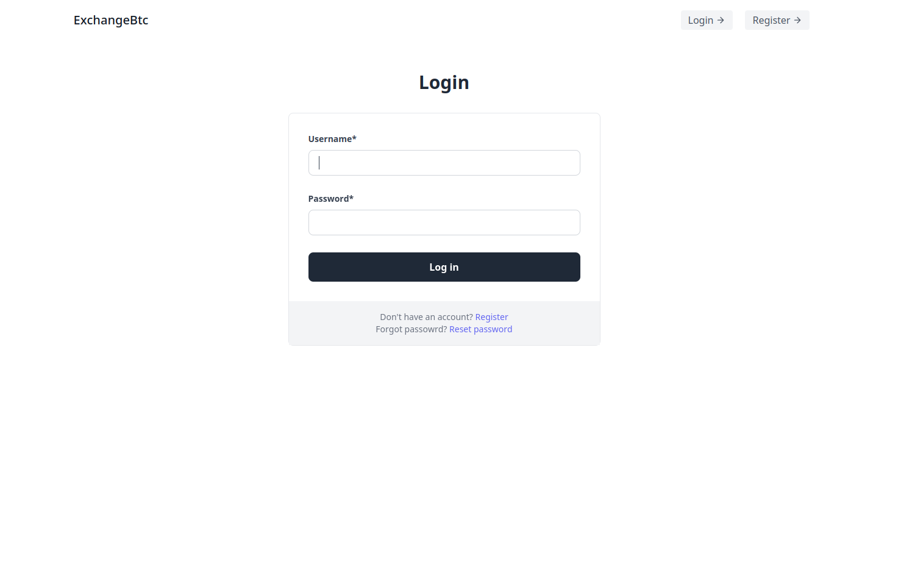
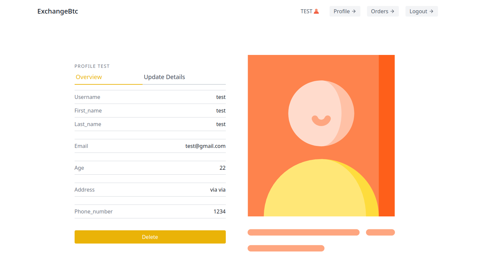
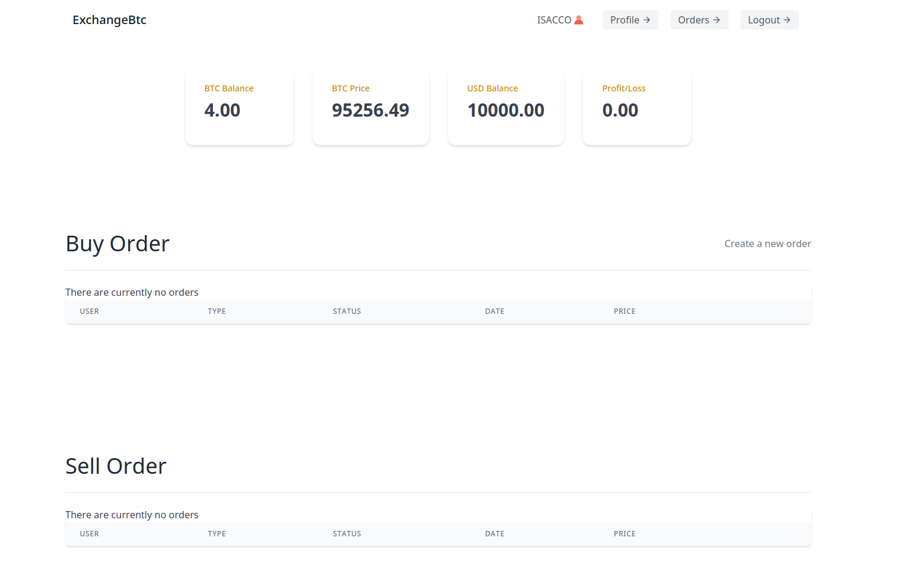
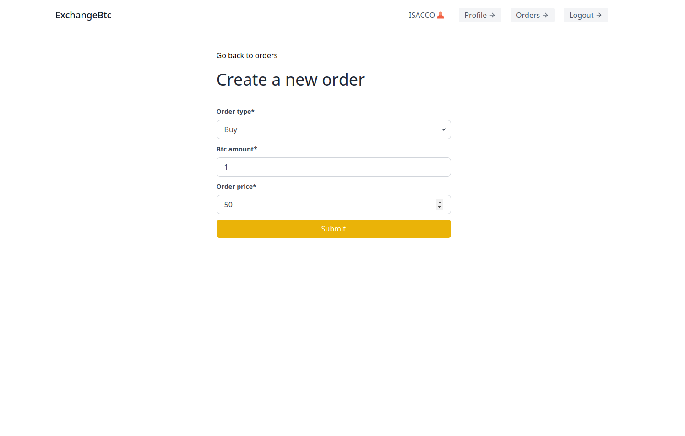
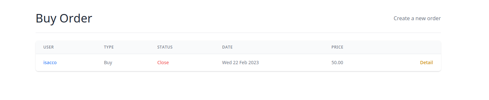
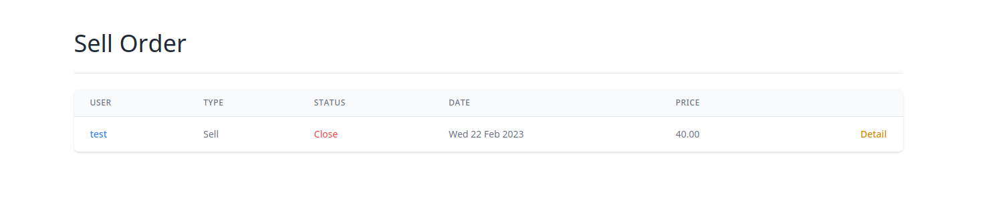
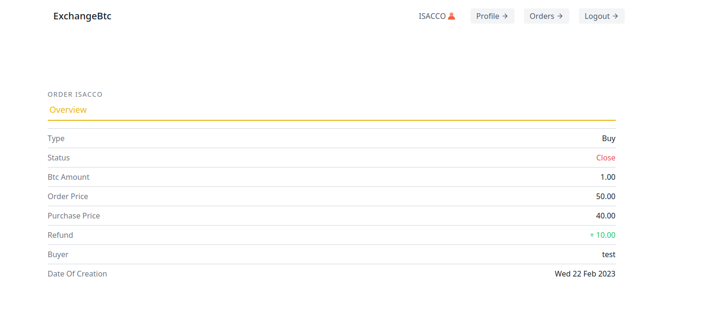
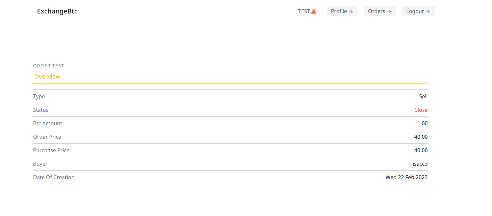
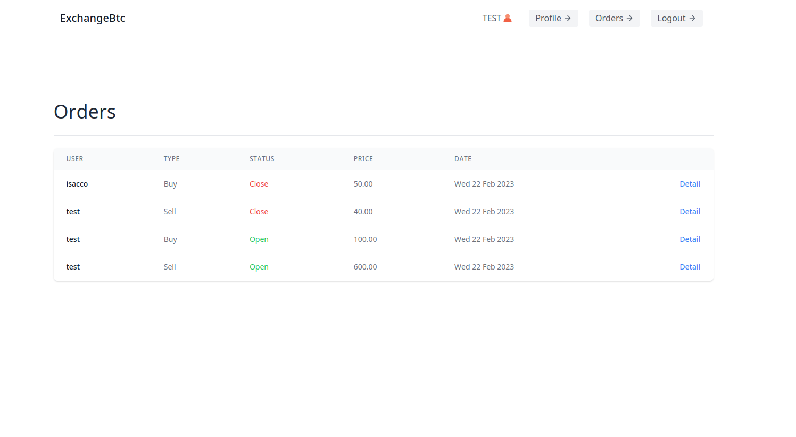
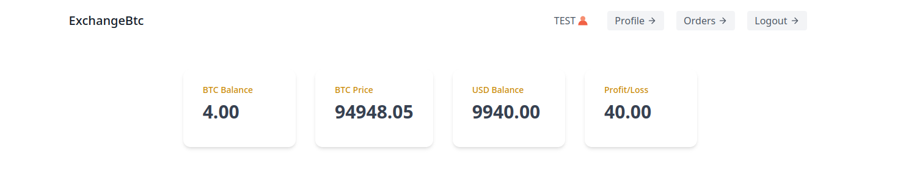

# MigrantSchool Web application

- An online Bitcoin exchange platform created with Django. It implements authentication, automatically assigns Bitcoin values, and allows users to create buy and sell orders. Completed orders are recorded on the blockchain.

## Requirements:

- The platform must include an endpoint to manage user registration and login.

    
    

- Automatically assign each registered user a variable amount of bitcoins between 1 and 10.

    

- Each user can publish one or more buy or sell orders for a certain amount of bitcoins at a certain price.

    
    

- At the time of publication, if the buy order price is equal to or higher than the sell price of any other user, record the transaction and mark both orders as fulfilled.

    
    
    
    

- Provide an endpoint to retrieve all active buy and sell orders.

    

- Also provide an endpoint to calculate the total profit or loss resulting from each user's transactions.

    

## Deployment

To deploy this project:
- Create a Virtual Environment
- Clone the repo and install requirements.txt
- Install and run the Mongodb DB server
- Make database migrations
- > `python manage.py runserver`.
- open `http://127.0.0.1:8000/` in browser

## Skills
Django, Djongo, Mongodb, Python, HTML, CSS

## 🔗 Links

 
<a href="https://demo2.isaccobertoli.com/">Try Demo</a>
